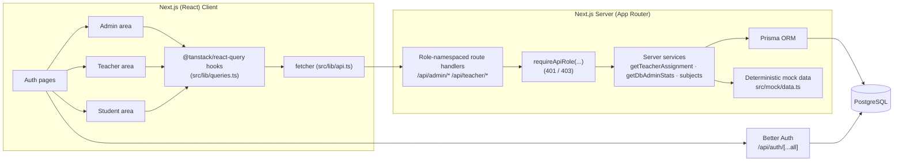
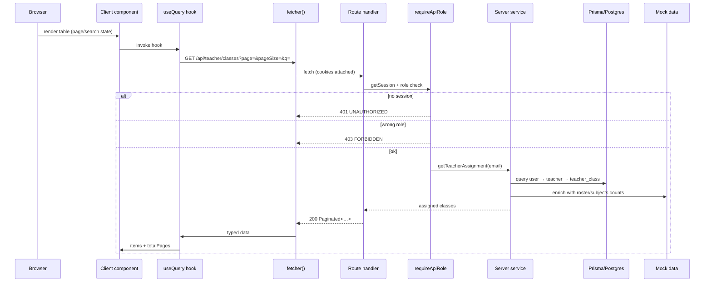
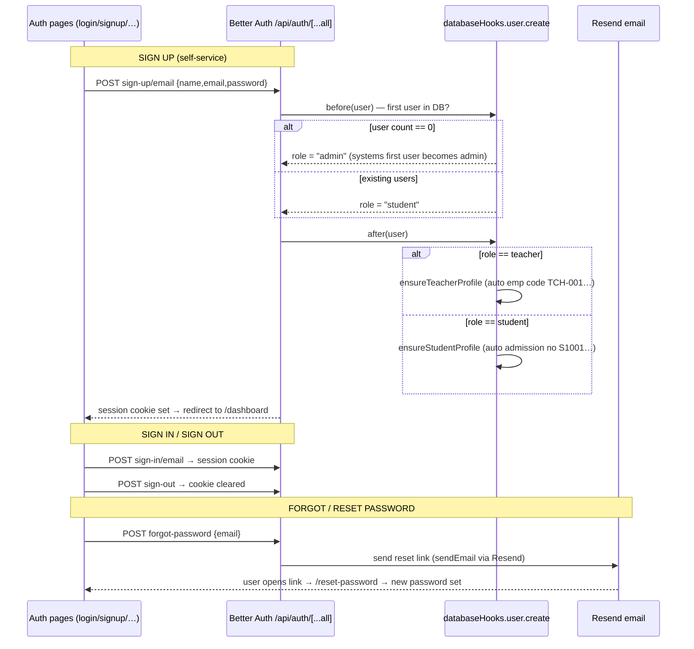
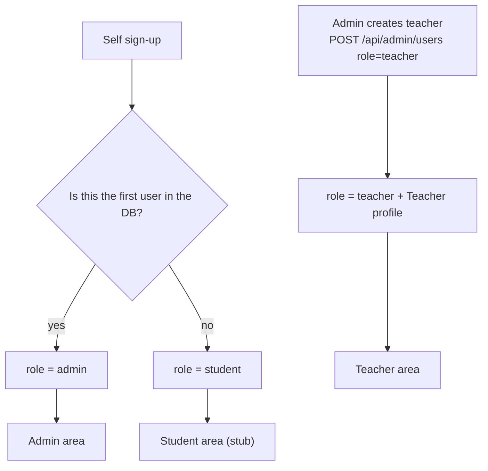
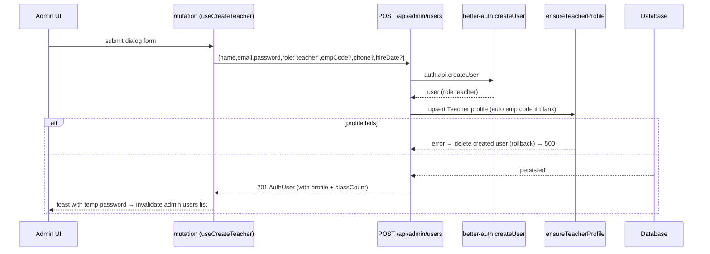
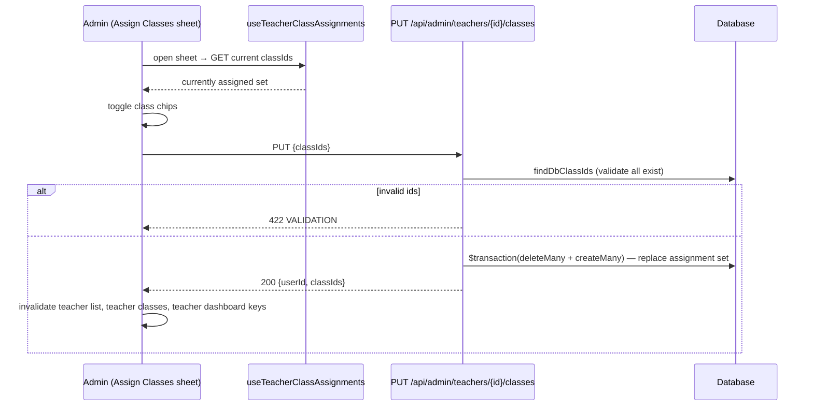

# School Management System — Implementation, Architecture & Flows

A living reference for the **currently implemented** system. It documents the real stack, data model, auth flows, API contract, feature flows, and what is real database data vs. mock enrichment. Anything marked **backlog** is not built yet.

---

## 1. Overview

Single-school management that runs in three role-scoped areas (**admin**, **teacher**, **student**) behind cookie-session authentication. The live implementation covers:

- Email/password sign-up, sign-in, sign-out, forgot/reset password.
- Admin management of **user accounts** (teachers/students) and a **class catalog** (Grades 1–12 + section).
- Admin management of a **subject catalog** (code + name) and assigning **subjects to teachers**.
- Admin creation of **students** (login + profile) and **enrollment** into one class, with edit/move and delete.
- Admin assignment of **classes to teachers** (stored in the database).
- Admin **dashboard** with live PostgreSQL counts and metrics for students, teachers, classes, subjects, and class sizes.
- Teacher **dashboard**, **My Classes**, **My Subjects**, class **roster**, and **student directory** views — real students and subjects, scoped strictly to the classes and subjects assigned to them.
- Server-driven **pagination + search** on every list.

Users, profiles, classes, subjects, teacher–class/subject assignments, and student **enrollments are real PostgreSQL data**. Only grades and attendance charts are currently enriched with **deterministic mock data** (same shapes as the future APIs).



---

## 2. Stack & Tools

| Layer | Choice |
|---|---|
| Framework | Next.js 16 (App Router, Turbopack) |
| UI | React 19, Tailwind CSS v4, shadcn/ui on Base UI |
| Server state | TanStack React Query 5 + devtools |
| Tables | TanStack Table 8 + shared `DataTable` wrapper |
| Forms | react-hook-form + zod (resolver) |
| Notifications | sonner `toast` |
| Charts | recharts |
| Auth | Better Auth 1.6 (`better-auth` + `next-js` + `admin` plugins) |
| ORM | Prisma 7 (`prisma-client` generator → `src/generated/prisma`) + `@prisma/adapter-pg` |
| Database | PostgreSQL (schema-driven migrations) |
| Email | Resend (password reset) |
| Tooling | Bun (`bun run`), ESLint 9, Prettier, TypeScript 6 |

---

## 3. Repository Layout (key paths)

```
prisma/
  schema.prisma                      # Real data model
  migrations/…20260908095621_…/      # Class + TeacherClass tables + seeded mirror classes
  migrations/…20260909054747_…/      # Enrollment table + status enum
  migrations/…20260909095000_…/      # Subject + TeacherSubject tables
src/
  app/
    (auth)/                           # /login /signup /forgot-password /reset-password
    (public)/                         # Landing page (logged out)
    (protected)/
      dashboard/                      # Role redirect: /dashboard -> /admin | /teacher | /student
      admin/                          # /admin (dashboard) · /admin/teachers · /admin/classes · /admin/students · /admin/subjects · /admin/profile
      teacher/                        # /teacher (dashboard) · /teacher/classes [/classId] · /teacher/students · /teacher/subjects · /teacher/profile
      student/                        # /student/profile · Student stub (under construction)
    api/
      auth/[...all]/route.ts          # Better Auth catch-all (GET/POST)
      health/route.ts                 # DB health check
      profile/route.ts                # GET user profile · PATCH update profile
      upload/sign/route.ts            # POST Cloudinary pre-signed upload parameters
      admin/users/route.ts            # GET list · POST create
      admin/students/route.ts         # GET list · POST create+enroll
      admin/students/[id]/route.ts    # PATCH (profile/move class) · DELETE
      admin/teachers/[userId]/classes/route.ts   # GET current · PUT replace class assignments
      admin/teachers/[userId]/subjects/route.ts  # GET current · PUT replace subject assignments
      admin/classes/route.ts          # GET list · POST create
      admin/classes/[id]/route.ts     # DELETE
      admin/subjects/route.ts         # GET list · POST create
      admin/subjects/[id]/route.ts    # DELETE
      admin/dashboard/route.ts        # GET live DB stats
      teacher/classes/route.ts        # GET My Classes (paginated)
      teacher/classes/[classId]/enrollments/route.ts  # GET real roster (paginated)
      teacher/students/route.ts       # GET student directory across assigned classes (paginated)
      teacher/subjects/route.ts       # GET assigned subjects for logged-in teacher (paginated)
      teacher/dashboard/route.ts      # GET teacher stats
  components/
    admin/   teachers-manager · classes-manager · assign-classes-sheet · assign-subjects-sheet · students-manager · subjects-manager
    teacher/ teacher-dashboard · my-classes · class-roster · teacher-students-manager · my-subjects
    profile/ avatar-upload · profile-info-form · change-password-form · profile-page-view
    data-table/ data-table.tsx        # client & server mode (pagination/search)
    ui/        dialog · sheet · table · … (shadcn)
  lib/
    auth.ts auth-client.ts            # Better Auth server & client
    api.ts                            # fetcher (throws ApiError.message)
    queries.ts                        # React Query hooks + invalidations
    use-safe-page.ts                  # page clamp helper
    profiles.ts                       # Teacher/Student profile upserts + auto codes
    roles.ts                          # role helpers/normalization
  server/
    admin.ts                          # getDbAdminStats live metrics service
    auth.ts                           # getSession / requireSession / requireRole (pages)
    api-auth.ts                       # requireApiRole / handleApiRoute / apiError (routes)
    cloudinary.ts                     # Cloudinary pre-signed SHA-1 signature generator
    profile.ts                        # getUserProfile & updateUserProfile service
    teacher.ts                        # assignment & stats services
    students.ts                       # student create/enroll/list/roster/update/delete
    subjects.ts                       # subjects catalog & teacher-subject assignments
    user.ts                           # isAuthenticated helper
  mock/
    data.ts                           # deterministic grades/attendance
    nav.ts                            # per-role navigation
  types/
    domain.ts                         # shared DTO types
    api.ts                            # CreateUserBody, ApiErrorCode
```

---

## 4. Architecture & Data Flow

**Client** components call React Query hooks in `src/lib/queries.ts`, which use a single `fetcher` (`src/lib/api.ts`). Every request goes to a **role-namespaced** URL; the server **never trusts the client** and re-checks the session role on every request.

- Page-level guard (Server): layouts call `requireRole('admin' | 'teacher' | 'student')` from `src/server/auth.ts` → redirects to `/login` if signed out, returns **403** if the role doesn't match.
- Route-level guard (Server): every API handler calls `requireApiRole(...)` from `src/server/api-auth.ts` → throws `401` (no session) or `403` (wrong role).
- Errors: `handleApiRoute` wraps handlers and maps thrown `ApiError`s to the `ApiError` envelope (`UNAUTHORIZED | FORBIDDEN | NOT_FOUND | CONFLICT | VALIDATION | INTERNAL`).



---

## 5. Auth Flow (by role)

Better Auth handles email/password sessions via cookies. `role` is a **string** on `User` with allowed values `admin | teacher | student`. Internal Better Auth only knows `admin | user`, so app code normalizes via `src/lib/roles.ts` (`normalizeRole`).





**Role accounting:**

- **Admin** — the *first* account created in an empty database (via the sign-up hook) becomes the admin.
- **Student** — any later self-service sign-up.
- **Teacher** — only created by the admin (`POST /api/admin/users` with `role: 'teacher'`). Profile (emp code, phone, hire date, designation) is auto-created; emp code defaults to next `TCH-###`. Admin shares the temporary password with the teacher after saving.
- **Password reset** emails are sent through Resend (`EMAIL_SENDER_NAME`, `EMAIL_SENDER_ADDRESS`, `RESEND_API_KEY`).

**Client auth:** `src/lib/auth-client.ts` exposes `authClient` (with the `adminClient` plugin) for the auth UI.

---

## 6. Data Model

### 6.1 Prisma schema (what is actually persisted)

```prisma
model User {
  id            String    @id @default(uuid())
  name          String
  email         String
  emailVerified Boolean   @default(false)
  image         String?
  role          String    @default("student") // "admin" | "teacher" | "student"
  banned        Boolean   @default(false)
  banReason     String?
  banExpiresAt  DateTime?
  createdAt     DateTime  @default(now())
  updatedAt     DateTime  @updatedAt
  sessions       Session[]   // Better Auth
  accounts       Account[]   // Better Auth
  teacherProfile Teacher?
  studentProfile Student?
  @@unique([email])
  @@map("user")
}

model Teacher {
  id          String        @id @default(uuid())
  userId      String        @unique
  user        User          @relation(fields: [userId], references: [id], onDelete: Cascade)
  empCode     String        @unique
  phone       String?
  hireDate    DateTime?
  designation String?
  classes     TeacherClass[]
  @@map("teacher")
}

model Student {
  id            String    @id @default(uuid())
  userId        String    @unique
  user          User      @relation(fields: [userId], references: [id], onDelete: Cascade)
  admissionNo   String    @unique
  dob           DateTime?
  gender        Gender?
  address       String?
  guardianName  String?
  guardianPhone String?
  enrollments   Enrollment[]
  @@map("student")
}

enum Gender { MALE FEMALE OTHER  @@map("gender") }

enum EnrollmentStatus { ACTIVE TRANSFERRED GRADUATED DROPPED  @@map("enrollment_status") }

model Class {
  id           String         @id @default(uuid())
  grade        Int            // 1..12
  section      String         @default("A")
  room         String?
  academicYear String         @default("2026-2027")
  assignments  TeacherClass[]
  enrollments  Enrollment[]
  @@unique([grade, section, academicYear])
  @@map("class")
}

model TeacherClass {
  id           String   @id @default(uuid())
  teacherId    String
  teacher      Teacher  @relation(fields: [teacherId], references: [id], onDelete: Cascade)
  classId      String
  class        Class    @relation(fields: [classId], references: [id], onDelete: Cascade)
  academicYear String   @default("2026-2027")
  @@unique([teacherId, classId, academicYear])
  @@index([teacherId, academicYear])
  @@map("teacher_class")
}

model Enrollment {
  id            String           @id @default(uuid())
  studentId     String
  schoolClassId String
  academicYear  String           @default("2026-2027")
  status        EnrollmentStatus @default(ACTIVE)
  enrolledAt    DateTime         @default(now())
  student       Student          @relation(fields: [studentId], references: [id], onDelete: Cascade)
  schoolClass   Class            @relation(fields: [schoolClassId], references: [id], onDelete: Cascade)
  @@unique([studentId, schoolClassId, academicYear])
  @@index([schoolClassId, academicYear])
  @@map("enrollment")
}

model Subject {
  id        String           @id @default(uuid())
  name      String           @unique
  code      String           @unique
  createdAt DateTime         @default(now())
  updatedAt DateTime         @updatedAt
  teachers  TeacherSubject[]
  @@map("subject")
}

model TeacherSubject {
  id        String   @id @default(uuid())
  teacherId String
  teacher   Teacher  @relation(fields: [teacherId], references: [id], onDelete: Cascade)
  subjectId String
  subject   Subject  @relation(fields: [subjectId], references: [id], onDelete: Cascade)
  createdAt DateTime @default(now())
  @@unique([teacherId, subjectId])
  @@index([teacherId])
  @@index([subjectId])
  @@map("teacher_subject")
}

// Session / Account / Verification — Better Auth managed (do not rename).
```

```mermaid
erDiagram
    USER ||--o| TEACHER : "teacherProfile"
    USER ||--o| STUDENT : "studentProfile"
    STUDENT ||--o{ ENROLLMENT : "enrolled in"
    CLASS ||--o{ ENROLLMENT : "holds students"
    TEACHER ||--o{ TEACHER_CLASS : "owns"
    CLASS ||--o{ TEACHER_CLASS : "assigned"
    TEACHER_CLASS }o--|| TEACHER : "teacherId"
    TEACHER_CLASS }o--|| CLASS : "classId"
    ENROLLMENT }o--|| STUDENT : "studentId"
    ENROLLMENT }o--|| CLASS : "schoolClassId"
    USER ||--o{ SESSION : "sessions"
    USER ||--o{ ACCOUNT : "accounts"

    USER { string id PK }
    TEACHER { string id PK "userId UNIQUE" string empCode UNIQUE }
    STUDENT { string id PK "userId UNIQUE" string admissionNo UNIQUE }
    CLASS { string id PK int grade string section string academicYear }
    TEACHER_CLASS { string id PK "teacherId FK" "classId FK" string academicYear }
    ENROLLMENT { string id PK "studentId FK" "schoolClassId FK" string academicYear string status }
```

### 6.2 Data ownership: real DB vs. mock enrichment

| Data | Persisted? | Source |
|---|---|---|
| User accounts, roles | ✅ | `user` table (Better Auth) |
| Teacher / Student profiles | ✅ | `teacher` / `student` tables |
| Classes (catalog) | ✅ | `class` table |
| Teacher↔class assignments | ✅ | `teacher_class` table |
| Teacher↔subject assignments | ✅ | `teacher_subject` table |
| Student→class enrollments | ✅ | `enrollment` table (drives real rosters + class counts) |
| Class rosters | ✅ | real — `enrollment` JOIN `student` |
| Subjects catalog | ✅ | `subject` table |
| Grades & attendance | ⚠️ mock | `src/mock/data.ts` (powers teacher dashboard) |

Mock data is **deterministic** (`mulberry32(20260907)`) and mirrors the query shapes a real backend would return, so swap-in is a drop-in later.

### 6.3 Migration & seed

- Migration `20260908095621_class_and_teacher_assignments` creates `class` + `teacher_class` and **idempotently seeds 6 mirror classes** matching the mock catalog:

| Grade | Section | Room | Academic year |
|---|---|---|---|
| 5 | A | Room 101 | 2026-2027 |
| 5 | B | Room 102 | 2026-2027 |
| 6 | A | Room 103 | 2026-2027 |
| 6 | B | Room 104 | 2026-2027 |
| 7 | A | Room 105 | 2026-2027 |
| 7 | B | Room 106 | 2026-2027 |

- Migration `20260909054747_add_enrollment_table` adds the **`enrollment`** table (+ `enrollment_status` enum) with compound uniqueness `(studentId, schoolClassId, academicYear)` — applied by `bun run migrate`.
- Migration `20260909095000_add_subject_and_teacher_subject_tables` adds the **`subject`** catalog table and **`teacher_subject`** join table with uniqueness on `(teacherId, subjectId)`.
- There is **no account seeding** — all accounts/profiles are created through the app.

---

## 7. Roles & Permissions Matrix (implemented scope)

`R` = read, `W` = write (create/update/delete), `—` = no access.

| Resource | Admin | Teacher | Student |
|---|---|---|---|
| User accounts (list, create) | R/W | — | — |
| Students (create, list, edit/move class, delete) | R/W | — | — (stub) |
| Student→class enrollments | R/W (assign/move/delete) | R (read own assigned rosters) | — (stub) |
| Teacher↔class assignments | R/W | R (own assigned only) | — |
| Teacher↔subject assignments | R/W | R (own assigned only) | — |
| Class catalog (add/delete/list) | R/W | R (own assigned) | — (stub) |
| Subject catalog (add/delete/list) | R/W | — | — (stub) |
| Class roster | — | R (own assigned, 403 otherwise) | — (stub) |
| Teacher My Subjects | — | R (own assigned) | — (stub) |
| Teacher Student Directory | — | R (across assigned classes) | — (stub) |
| Dashboard | R (real DB overview & metrics) | R (own stats) | stub |
| Grades / Attendance | planned | planned | planned |

---

## 8. API Reference (implemented)

### 8.1 Envelopes & shared types (`src/types/domain.ts`)

```ts
interface Paginated<T> {
  items: T[]; total: number; page: number; pageSize: number; totalPages: number;
}
// Error body:
interface ApiError { error: { code: "UNAUTHORIZED"|"FORBIDDEN"|"NOT_FOUND"|"CONFLICT"|"VALIDATION"|"INTERNAL"; message: string } }

interface AuthUser {
  id, name, email, role: "admin"|"teacher"|"student", image, emailVerified,
  banned, createdAt: string, classCount?: number,
  profile?: { empCode?, phone?, hireDate?, designation?, admissionNo?, classCount? }
}
interface ClassCatalogItem { id, grade: number, section, name, room, academicYear, studentCount }
interface TeacherClassSummary { id, name, studentCount }
interface Student { id, userId, admissionNo, name, email, dob, gender, address, guardianName, guardianPhone, currentClass: {id,name,section,academicYear} | null }
interface TeacherStats {
  myClasses: TeacherClassSummary[];
  subjectsTaught: { id, name, code }[];
  gradeDistributionForMyClasses: { className, "A+": number, A, B, C, D, F }[];
  attendanceRateByClass: { className, rate: number }[];
  averageStudentCount: number;
}
```

### 8.2 Endpoint tables

All endpoints require a session; role is enforced server side on each request.

**Auth (Better Auth catch-all) — `POST|GET /api/auth/[...all]`**

| Action | Path |
|---|---|
| Sign up | `POST /api/auth/sign-up/email` |
| Sign in | `POST /api/auth/sign-in/email` |
| Sign out | `POST /api/auth/sign-out` |
| Session | `GET /api/auth/get-session` |
| Forgot / reset | `POST /api/auth/forgot-password` · `/reset-password` |
| Admin plugin (ban, impersonate…) | `POST /api/auth/admin/*` |

**Profile & Upload — `src/app/api/profile/*` & `src/app/api/upload/*`**

| Method & Path | Query / Body | Response | Errors |
|---|---|---|---|
| `GET /api/profile` | — (reads session user) | `UserProfile` (user + teacher/student details) | 401, 404 |
| `PATCH /api/profile` | `{ name?, image?, phone?, dob?, gender?, address?, guardianName?, guardianPhone? }` | `UserProfile` | 401, 404, 422 |
| `POST /api/upload/sign` | — | `{ signature, timestamp, apiKey, cloudName, folder }` | 401, 500 (missing credentials) |

**Admin — `src/app/api/admin/*`**

| Method & Path | Query / Body | Response | Errors |
|---|---|---|---|
| `GET /api/admin/users` | `role?`, `q?`, `page=1`, `pageSize=20` (≤100); filter name/email `contains`; order `createdAt desc` | `Paginated<AuthUser>` | 401, 403, 422 |
| `POST /api/admin/users` | `{ name, email, password≥8, role, empCode?, phone?, hireDate? }` | `201 AuthUser` | 401, 403, 409 (email/emp code), 422, 500 |
| `PATCH /api/admin/teachers/[userId]` | `{ name?, phone?, designation?, empCode?, hireDate? }` | `AuthUser` | 401, 403, 404, 409 (empCode in use), 422 |
| `GET /api/admin/students` | `q?` (name/email/admission/guardian), `page=1`, `pageSize=10` (≤100) | `Paginated<Student>` (with `currentClass`) | 401, 403, 422 |
| `POST /api/admin/students` | `{ name, email, password≥8, schoolClassId, admissionNo?, dob?, gender?, address?, guardianName?, guardianPhone? }` → account + profile + **one** enrollment | `201 Student` | 401, 403, 409 (email/admission no), 404 (class), 422, 500 |
| `PATCH /api/admin/students/[id]` | `{ name?, dob?, gender?, address?, guardianName?, guardianPhone?, schoolClassId? }` — `schoolClassId` moves the student to another class | `Student` | 401, 403, 404, 409 (already enrolled), 422 |
| `DELETE /api/admin/students/[id]` | — cascades account/profile/enrollments | `{ id }` | 401, 403, 404 |
| `GET /api/admin/teachers/[userId]/classes` | — | `{ classIds: string[] }` | 401, 403, 404 |
| `PUT /api/admin/teachers/[userId]/classes` | `{ classIds: string[] }` (replace-all, transactional) | `{ userId, classIds }` | 401, 403, 404, 422 (unknown id) |
| `GET /api/admin/teachers/[userId]/subjects` | — | `{ subjectIds: string[] }` | 401, 403, 404 |
| `PUT /api/admin/teachers/[userId]/subjects` | `{ subjectIds: string[] }` (replace-all, transactional) | `{ userId, subjectIds }` | 401, 403, 404, 422 (unknown id) |
| `GET /api/admin/classes` | `q?`, `page=1`, `pageSize=10` (≤1000); filter grade numeric OR section/room `contains`; order `grade asc, section asc` | `Paginated<ClassCatalogItem>` | 401, 403, 422 |
| `POST /api/admin/classes` | `{ grade: 1..12, section? (A), room? }` | `201 ClassCatalogItem` | 401, 403, 409 (duplicate), 422 |
| `PATCH /api/admin/classes/[id]` | `{ grade?: 1..12, section?, room? }` | `ClassCatalogItem` | 401, 403, 404, 409 (duplicate), 422 |
| `DELETE /api/admin/classes/[id]` | — | `{ id }` | 401, 403, 404 |
| `GET /api/admin/subjects` | `q?`, `page=1`, `pageSize=10` (≤100); filter name/code `contains`; order `name asc` | `Paginated<SubjectWithTeacherCount>` | 401, 403, 422 |
| `POST /api/admin/subjects` | `{ name, code }` | `201 Subject` | 401, 403, 409 (duplicate), 422 |
| `DELETE /api/admin/subjects/[id]` | — | `{ id }` | 401, 403, 404 |
| `GET /api/admin/dashboard` | — | `AdminStats` | 401, 403 |

**Teacher — `src/app/api/teacher/*`**

| Method & Path | Query / Body | Response | Errors |
|---|---|---|---|
| `GET /api/teacher/classes` | `q?`, `page=1`, `pageSize=10` (≤100) | `Paginated<TeacherClassSummary>` | 401, 403, 404 (profile) |
| `GET /api/teacher/classes/[classId]/enrollments` | `q?` (name/email/admissionNo/guardian), `page`, `pageSize` | `Paginated<Student>` (real roster) | 401, 403 (unassigned), 404 (profile) |
| `GET /api/teacher/students` | `q?` (name/email/admission/guardian), `classId?`, `page=1`, `pageSize=10` (≤100) | `Paginated<Student>` (across assigned classes) | 401, 403, 404 (profile), 422 |
| `GET /api/teacher/subjects` | `q?`, `page=1`, `pageSize=10` (≤100) | `Paginated<Subject>` (assigned to teacher) | 401, 403, 404 (profile), 422 |
| `GET /api/teacher/dashboard` | — | `TeacherStats` | 401, 403, 404 (profile) |

**Health**

| Method & Path | Response |
|---|---|
| `GET /api/health` | 200 `{ status:"healthy", database:"connected", timestamp }` or 503 |

### 8.3 Example payloads

```jsonc
// GET /api/admin/classes?page=1&pageSize=2
{
  "items": [
    { "id": "…", "grade": 5, "section": "A", "name": "Class 5 A", "room": "Room 101", "academicYear": "2026-2027", "studentCount": 8 }
  ],
  "total": 6, "page": 1, "pageSize": 2, "totalPages": 3
}

// POST /api/admin/teachers/{userId}/classes body → replace all assignments
{ "classIds": ["<class-id-1>", "<class-id-2>"] }

// POST /api/admin/students body → creates account + profile + enrollment in one class
{
  "name": "Aarav Sharma",
  "email": "aarav@school.edu",
  "password": "studentpass",
  "schoolClassId": "<class-5a-id>",
  "guardianName": "Mr. Raj Sharma"
}

// GET /api/admin/students → item shape (Student)
{
  "items": [{
    "id": "…", "userId": "…", "admissionNo": "S1001",
    "name": "Aarav Sharma", "email": "aarav@school.edu",
    "dob": null, "gender": null, "address": null,
    "guardianName": "Mr. Raj Sharma", "guardianPhone": null,
    "currentClass": { "id": "…", "name": "Class 5 A", "section": "A", "academicYear": "2026-2027" }
  }],
  "total": 1, "page": 1, "pageSize": 10, "totalPages": 1
}

// GET /api/teacher/dashboard
{
  "myClasses": [{ "id": "…", "name": "Class 5 A", "studentCount": 8 }],
  "subjectsTaught": [{ "id": "sub-math", "name": "Mathematics", "code": "MATH" }],
  "gradeDistributionForMyClasses": [{ "className": "Class 5 A", "A+": 9, "A": 7, "B": 12, "C": 8, "D": 6, "F": 3 }],
  "attendanceRateByClass": [{ "className": "Class 5 A", "rate": 86.7 }],
  "averageStudentCount": 8
}
```

---

## 9. Feature Flows

### 9.1 Admin creates a teacher



### 9.2 Admin creates a class

`POST /api/admin/classes` validates `grade` (1–12), upper-cases `section`, checks the unique `(grade, section, academicYear)` key → `409` on duplicates, then returns the full `ClassCatalogItem` from the catalog. UI: centered `Dialog` modal; on success invalidates the Classes list.

### 9.3 Admin assigns classes to a teacher



### 9.4 Admin manages students

`POST /api/admin/students` creates the `user`(student) + `account` + `student` profile + one `enrollment` into the chosen class; `PATCH /api/admin/students/[id]` updates the profile and/or **moves** the single `schoolClassId` (no duplicates); `DELETE` cascades everything. `GET /api/admin/students` returns the real list with `currentClass`.

### 9.5 Teacher views My Classes / roster

`/teacher/classes` uses server-mode `DataTable` (`GET /api/teacher/classes`). Clicking a class goes to `/teacher/classes/[classId]` — the page re-resolves the assignment server-side (`getTeacherAssignment`) and calls `notFound()` if the class isn't theirs, then renders the roster (`GET /api/teacher/classes/[classId]/enrollments`) from **real enrollment rows**. The API independently returns **403** for unassigned classes; classes with no enrolled students show an empty state.

### 9.6 Teacher dashboard

`GET /api/teacher/dashboard` → `buildTeacherStats(assignedClasses)`: class list & sizes, subjects taught, grade distribution (`A+…F`), attendance rate per class, average class size. Class sizes (`studentCount`) are real enrollment counts; grades/attendance are still read from mock data keyed on `cls-{grade}-{section}` for chart enrichment.

---

## 10. Pagination & Search Mechanics

All list endpoints return the `Paginated<T>` envelope and support `q`, `page`, `pageSize`.

- **`DataTable` server mode** (`mode="server"`) sets TanStack `manualPagination` + `manualFiltering`, accepts `page/pageSize/search/total` and callbacks.
- **Debounce:** the search input keeps its own instant state; a 300 ms `setTimeout` (cleaned up on unmount) fires `onSearchChange`, so the UI feels instant while requests are debounced.
- **Page clamp:** `useSafePage(page, totalPages, onChange)` keeps `page ≤ totalPages` without clamping while `totalPages` is `undefined` (loading).
- **React Query:** paginated hooks use `placeholderData: keepPreviousData` (no flicker on page change); search/page changes reset to page 1; mutations invalidate the correct key prefixes.

```mermaid
flowchart LR
    TYP[type in search box] --> IN[input state updates instantly]
    IN --> DEB{300 ms debounce timer}
    DEB --> CH[onSearchChange(q) + setPage(1)]
    CH --> RQ[queryKey changes]
    RQ --> FET[fetch ?page=&pageSize=&q=]
    FET --> CL[clamp page via useSafePage]
    CL --> RENDER[render DataTable server mode]
```

---

## 11. UI Screens & Navigation

Navigation is role-based (`src/mock/nav.ts`). Admin and teacher areas also expose planned-but-empty routes as placeholders.

| Area | Screen | Data source |
|---|---|---|
| Auth | Login, Sign up, Forgot password, Reset password | Better Auth |
| Public | Landing page | — |
| Redirect | `/` → `/dashboard` → role home | session role |
| Admin | `/admin` Dashboard (stats & charts) | `getDbAdminStats()` (real PostgreSQL stats & totals) |
| Admin | `/admin/teachers` Teachers + Assign classes & subjects | `/api/admin/users` + `/api/admin/teachers/*` |
| Admin | `/admin/classes` Classes catalog + Add class | `/api/admin/classes` |
| Admin | `/admin/subjects` Subjects catalog + Add subject | `/api/admin/subjects` |
| Admin | `/admin/students` Students + Add/Edit/Delete | `/api/admin/students` |
| Admin | `/admin/profile` Admin Profile & Avatar | `/api/profile` + `/api/upload/sign` |
| Teacher | `/teacher` Dashboard | `/api/teacher/dashboard` |
| Teacher | `/teacher/classes` My Classes | `/api/teacher/classes` |
| Teacher | `/teacher/classes/[classId]` Roster (real) | `/api/teacher/classes/[classId]/enrollments` |
| Teacher | `/teacher/students` Students directory | `/api/teacher/students` + `/api/teacher/classes` |
| Teacher | `/teacher/subjects` My Subjects | `/api/teacher/subjects` |
| Teacher | `/teacher/profile` Teacher Profile & Avatar | `/api/profile` + `/api/upload/sign` |
| Teacher | Grades · Attendance | placeholder ("Coming soon") |
| Student | `/student/profile` Student Profile & Avatar | `/api/profile` + `/api/upload/sign` |
| Student | `/student` stub, other `student/*` nav items | stub (not built) |

Nav details: Admin shows **Dashboard, Students, Teachers, Classes, Subjects** (Grades/Attendance/Users & Roles commented out). Teacher shows **Dashboard, My Classes, Students, Grades, Attendance, Subjects**. Student nav lists Dashboard/My Grades/My Attendance/My Classes/Profile (pages are stubs).

---

## 12. Implemented vs. Backlog

| Capability | Status |
|---|---|
| Auth (email/password, sessions, reset) | ✅ Implemented |
| Roles + page/route guards | ✅ Implemented |
| Admin users & teacher creation | ✅ Implemented |
| Class catalog CRUD | ✅ Implemented (create/list/edit/delete) |
| Assign classes to teachers | ✅ Implemented (replace-all, transactional) |
| Subjects catalog CRUD | ✅ Implemented (create/list/delete) |
| Assign subjects to teachers | ✅ Implemented (during creation & via assign sheet) |
| Teacher subjects view | ✅ Implemented (display assigned subjects for logged-in teacher) |
| Enrollment (real `enrollment` table) | ✅ Implemented |
| Admin student management (create/enroll/edit/move/delete) | ✅ Implemented |
| Real class & roster counts | ✅ Implemented (enrollment-driven) |
| Teacher dashboard / classes / roster | ✅ Implemented (real rosters; grades/attendance mock-enriched) |
| Teacher students directory | ✅ Implemented (across assigned classes + search & filter) |
| Admin dashboard endpoint & stats | ✅ Implemented (real DB counts for students, teachers, classes, subjects, sizes & enrollments) |
| **Profile pages (Admin, Teacher, Student)** | ✅ Implemented (role-scoped editables & read-only cards) |
| **Cloudinary pre-signed avatar upload** | ✅ Implemented (direct browser-to-Cloudinary signed upload) |
| **Password change & security** | ✅ Implemented (Better Auth session-safe password update) |
| Server-side pagination + search | ✅ Implemented (all lists) |
| Modal dialogs, responsive shell, dark mode | ✅ Implemented |
| Real `Grade`/`Attendance` DB tables | 🔜 Backlog |
| Student area (grades/attendance/classes views) | 🔜 Backlog |
| Grades & attendance entry UIs | 🔜 Backlog |
| Email sender domain swap | 🔜 Backlog (approved) |

---

## 13. Local Setup

```bash
bun install
bun run generate      # prisma generate
bun run migrate       # prisma migrate dev → applies class/teacher_class (~seed) + enrollment + subject migrations
bun run dev           # http://localhost:3000
```

Env vars: `DATABASE_URL`, `BETTER_AUTH_SECRET`, `BETTER_AUTH_URL`, `RESEND_API_KEY`, `EMAIL_SENDER_NAME`, `EMAIL_SENDER_ADDRESS`.

Other scripts: `bun run lint` (ESLint), `bunx tsc --noEmit` (typecheck), `bun run studio` (Prisma Studio), `bun run build` / `start` (prisma generate/migrate deploy + next).

---

## 14. Acceptance Checklist (current)

**Auth**
- [ ] Unauthenticated call to any protected endpoint → `401`.
- [ ] Wrong role on a protected endpoint/page → `403`.
- [ ] First sign-up becomes `admin`; later self sign-ups become `student`.
- [ ] Admin-created teacher gets a `Teacher` profile + auto emp code.

**Users**
- [ ] Duplicate email → `409`.
- [ ] Duplicate emp code → `409`.
- [ ] Teacher list shows profile fields + assigned class count + assigned subjects count.

**Students**
- [ ] `POST /api/admin/students` creates `user` + `account` + `student` + one `enrollment`.
- [ ] Duplicate email or admission no → `409`; unknown class → `404`.
- [ ] Added student appears in the selected class roster for an assigned teacher.
- [ ] `PATCH` with a different `schoolClassId` **moves** the student (no duplicate enrollment); same class is a no-op.
- [ ] `DELETE` removes the student, their account, and all enrollments (cascade).

**Classes**
- [ ] Duplicate `(grade, section, academicYear)` → `409`.
- [ ] `GET/POST/DELETE /api/admin/classes` work with correct `Paginated` totals.
- [ ] Class `studentCount` reflects real enrollments.
- [ ] Delete cascades `teacher_class` rows.

**Subjects**
- [ ] Duplicate subject name or code → `409`.
- [ ] `GET/POST/DELETE /api/admin/subjects` work with correct pagination and teacher counts.
- [ ] `PUT /api/admin/teachers/[userId]/subjects` replaces qualifications atomically.
- [ ] Teacher sees assigned subjects under `/teacher/subjects`.

**Assignments**
- [ ] `PUT /api/admin/teachers/[userId]/classes` replaces the set atomically.
- [ ] Unknown class id → `422`; unknown teacher → `404`.
- [ ] Teacher sees only assigned classes; unassigned class roster → `403`.

**Dashboard & Directory**
- [ ] Admin `/admin` displays live counts for students, teachers, classes, subjects, and class sizes.
- [ ] Teacher `/teacher/students` shows all students across assigned classes with class filters.

**Pagination / search**
- [ ] All lists respect `page`, `pageSize`, `q` with correct `total`/`totalPages`.
- [ ] Search is debounced (300 ms) and resets to page 1.

**Seed / migration**
- [ ] `bun run migrate` creates the tables and seeds the 6 mirror classes idempotently.

---

## 15. Glossary

- **Assignment** — a `teacher_class` row linking a teacher to a class for `2026-2027`.
- **Enrollment** — an `enrollment` row placing a student in a class for the academic year (`ACTIVE` status); what makes a student appear in a roster.
- **Class catalog** — persistent `class` rows (grade + section) the admin manages.
- **Mirror class** — a seeded DB class matching a mock catalog key (`cls-5-a` → Class 5 A).
- **Mock enrichment** — deterministic sample subjects/grades/attendance used where DB tables are not yet built.
- **Envelope** — the consistent `Paginated<T>` / `ApiError` JSON wrappers.
- **Academic year** — constant `2026-2027` for the current school cycle.